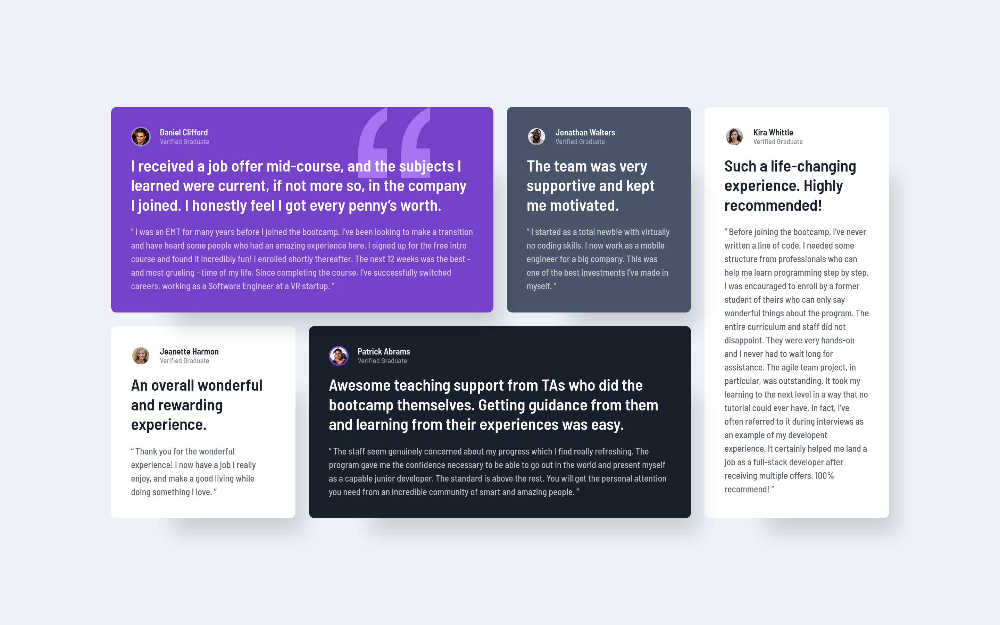
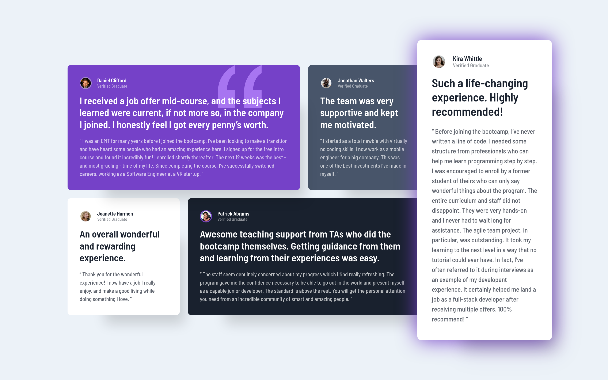

# Frontend Mentor - Testimonials grid section solution

This is a solution to the [Testimonials grid section challenge on Frontend Mentor](https://www.frontendmentor.io/challenges/testimonials-grid-section-Nnw6J7Un7). Frontend Mentor challenges help you improve your coding skills by building realistic projects.

## Table of contents

- [Frontend Mentor - Testimonials grid section solution](#frontend-mentor---testimonials-grid-section-solution)
  - [Table of contents](#table-of-contents)
  - [Overview](#overview)
    - [The challenge](#the-challenge)
    - [Screenshot](#screenshot)
    - [Links](#links)
  - [My process](#my-process)
    - [Built with](#built-with)
    - [What I learned](#what-i-learned)
    - [Continued development](#continued-development)
    - [Useful resources](#useful-resources)
  - [Author](#author)

## Overview

### The challenge

Users should be able to:

-   View the optimal layout for the site depending on their device's screen size

### Screenshot

Desktop

Desktop - hover

### Links

- [View Solution in Frontend Mentor](https://www.frontendmentor.io/solutions/responsive-testimonials-grid-section-animations-Z9Xofw01GU)
- [Go to Demo Site](https://lau-san.github.io/fm-testimonials-grid-section/)

## My process

### Built with

-   Semantic HTML5 markup
-   CSS custom properties
-   Flexbox
-   CSS Grid
-   Mobile-first workflow
-   [Sass](https://sass-lang.com)

### What I learned

-   I learned a bit more about Sass. Mainly partials and modules.
-   I got more practice with CSS Grid and animations.

### Continued development

I'll keep learning Sass, since there's still a lot that I don't know about it.

### Useful resources

-   [Sass, BEM & Responsive Design](https://www.youtube.com/watch?v=jfMHA8SqUL4) - I'm learning Sass with this course.

## Author

-   Frontend Mentor - [@Lau-San](https://www.frontendmentor.io/profile/Lau-San)
